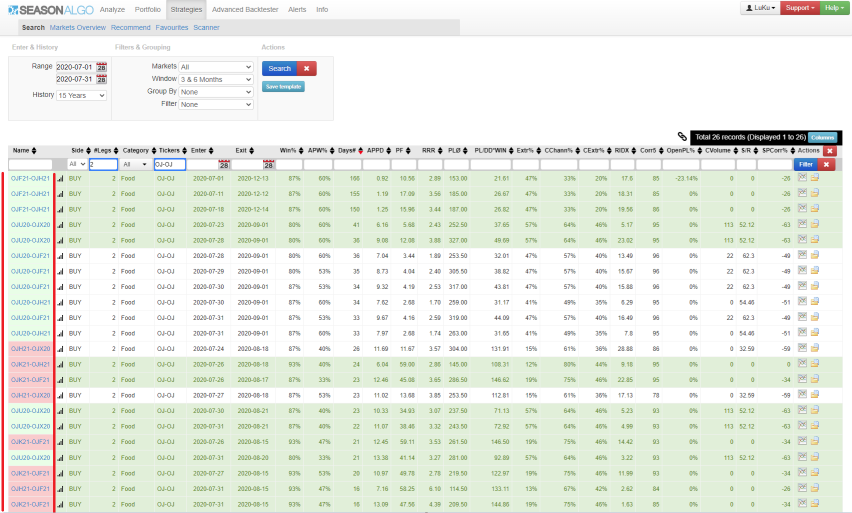

## Seasonalgo Bear/Bull Highlighter

In search https://www.seasonalgo.com/ extension highlight bear or bull spread red / green background color (sometime need refresh by F5 key).

### Install:

Download Zip a unzip to own permanent folder.

* Open the Extension Management page by navigating to chrome://extensions
* Enable Developer Mode by clicking the toggle switch next to <b>Developer mode</b>.
* Click the LOAD UNPACKED button and select the extension directory.

Ta-da! The extension has been successfully installed.

